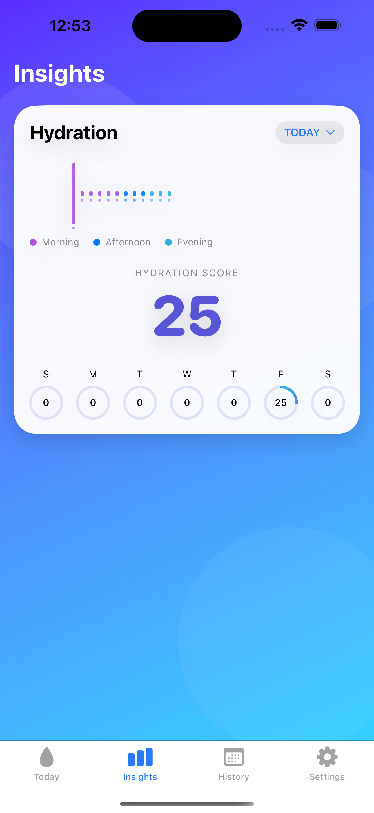
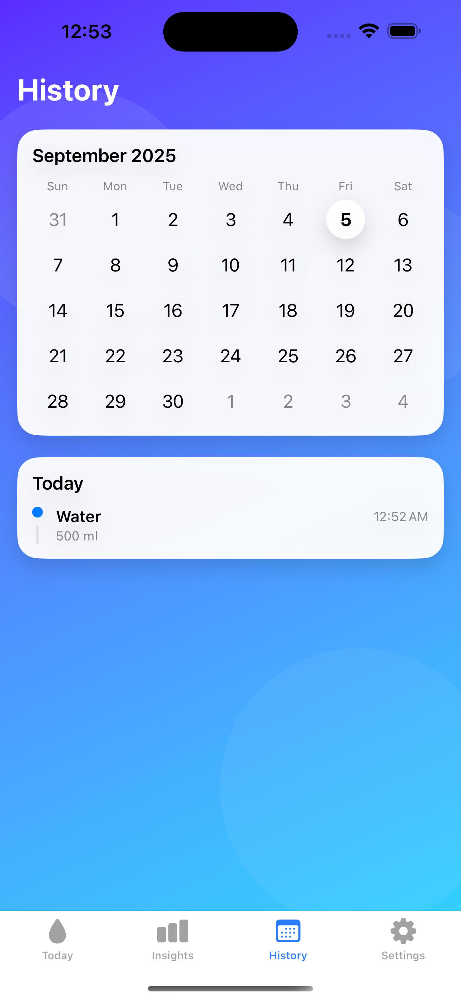

# AquaBean — Simple daily water tracker

Keep your hydration on track with one‑tap logging, a clean hydration ring, gentle reminders, and streaks — designed to be private by default.

- Live site: https://kalyanviswanath.github.io/AquaBean/
- App Store: Coming soon

## Features
- One‑tap logging: Quickly add common amounts (250/350/500 ml) or customize.
- Hydration ring: See progress toward your daily goal at a glance.
- Smart reminders: Gentle nudges during your active hours. No spam.
- Streaks & motivation: Build consistency with streaks and badges.
- Custom goals & units: Choose ml or oz and set your goal.
- Private by design: Data stays on your device. No analytics or tracking.

## Screenshots

## Support
- Questions or feedback? Open an issue: https://github.com/kalyanviswanath/AquaBean/issues
- FAQs and contact: https://kalyanviswanath.github.io/AquaBean/support.html

## Privacy
Read the policy: https://kalyanviswanath.github.io/AquaBean/privacy.html

## Project status
This repository hosts the landing site for AquaBean. The iOS app is in active development; App Store link will be added when available.
